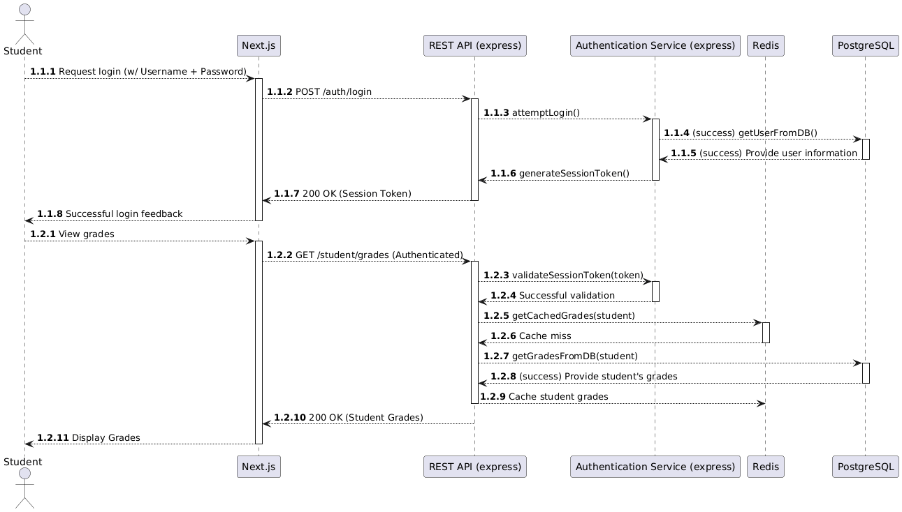
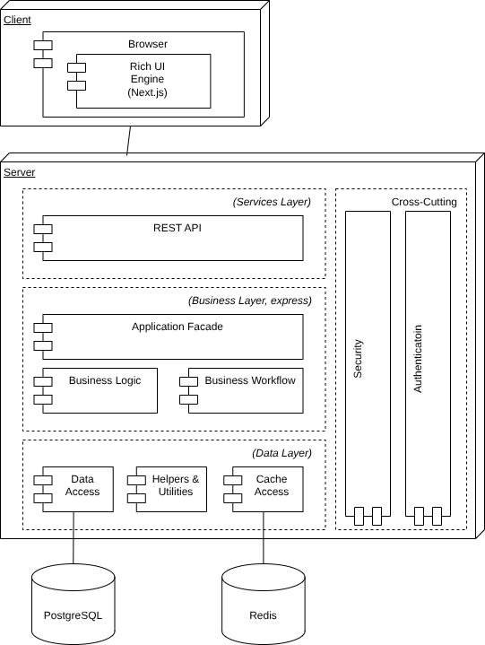

# ADD Iteration 1

## Step 1 - Review Inputs

The design inputs were established in a previous phase of the project in the following files:

```
Business Driver
Concerns.md
Constraints.md
Quality Attributes.md
Use Cases.md
```

However, they will be briefly reestablished in this document:

### Business Driver

The main driver for AIDAP is to provide a conversational interface for students, faculty, and administrators to interact with

institutional data such as course schedules, deadlines, announcements, and academic analytics. The
assistant integrates with external university systems (LMS, registration, calendars, and mail) and uses AI
to deliver contextual answers.

We want to create a system that is maintainable, scalable and reliable.
For students it will save time and keep them organized.
For instructors, it makes sharing updates and managing classes easy and simple.
For administrators, it will make data management consistent and clear.

### Concerns

- CRN-1 The system shall maintain data integrity and consistency across systems.
- CRN-2 The system shall support scalability to handle up to 5,000 concurrent users.
- CRN-3 The system shall ensure that only authorized lecturers can modify course data.
- CRN-4 The system shall protect user data and comply with institutional privacy policies.
- CRN-5 The system shall remain available 99.5% of the time per month.
- CRN-6 The system shall respond to queries within 2 seconds on average under normal load.

### Quality Attributes

- QA-1 Reliability
- QA-2 Usability
- QA-3 Privacy & Security
- QA-4 Interoperability
- QA-5 Scalability
- QA-6 Maintainability

### Use Cases

- UC-1 The student exports their calendar
- UC-2 The student uses the dashboard to view their grades
- UC-3 A lecturer posts an announcement for their course
- UC-4 A lecturer uploads courses content via the AIDAP
- UC-5 An administrator sends a campus-wide announcement
- UC-6 An administrator generates an analytics report

## Step 2 - Establish Iteration Goal by Selecting Drivers

After reviewing the drivers, iteration 1 will be focused on **establishing an overall system structure**.

More specifically, the following drivers will be focused on during this iteration:

| Driver ID | Driver Name                                                                   |
| --------- | ----------------------------------------------------------------------------- |
| QA-1      | Reliability                                                                   |
| QA-2      | Usability                                                                     |
| QA-3      | Privacy & Security                                                            |
| UC-2      | The student uses the dashboard to view their grades                           |
| CRN-3     | The system shall ensure that only authorized lecturers can modify course data |

## Step 3 - Choose One or More Elements of the System to Decompose
To achieve the iteration goal of developing the overall system, this iteration will be focusing on:
* The **User Interface**, which will include how the user interacts with the system.
* The **Server**, including authentication and business logic.
* The **Data Access Layer**, including the potential data storage systems.

## Step 4 - Choose One or More Design Concepts that Satisfy the Inputs Considered in the Iteration

**Design Choice** - System Architecture
| Design Concept | Pros | Cons | Cost |
| ----------------------- | ------------------------------ | ------------------------------------------------- | ---- |
| Rich Client Application | Highly Responsive (+ QA-1)<br> | Needs to be installed on each device (- QA-2) | High |
| Rich Internet Application | Highly Responsive (+ QA-1)<br>Can be accessed anywhere (+ QA-2) | Requires an internet connection to use (- QA-2) | Medium |
| Mobile Application | Can be accessed from anywhere (+ QA-2) | Unable to reliably access any remote data (- QA-1, - QA-2) | High |

After reviewing the above table, the decision is to move forward with the **Rich Internet Application** for the user interface.

## Step 5 - Instantiate Architectural Elements, Allocate Responsibilites, and Define Interfaces

To implement the **Rich Internet Application**, the following design decisions have been made:
| Design Decision | Rationale |
| --------------- | --------- |
| Use PostgreSQL for the data storage | PostgreSQL is an open source, reliable (QA-1). The choice to use a relational database is to increase the cohesion of data, making it easier to query, which allows for better usage by the consumer on the frontend (QA-2) |
| Use Redis as a cache for frequently used & aggregated data | Caching allows the user to quickly access data that is frequently accessed, allowing for much faster response times and higher usability (QA-2). |
| Implement Rich UI using Next.js | Next.js is a popular web development framework for providing the user access to backend information. It's a highly reliable framework (QA-1), and due to it's "Hydration" feature, which allows pages to be send to the client before the rich, JavaScript is processed, increases usability (QA-2) |
| Use JSONWebTokens (JWTs) to implement the authentication system | A huge factor of web applications is providing a level of security, which JWTs provide (QA-3). By using user roles with JWTs, it's also possible to separate who gets access to what information (CRN-3). Additionally, by using JWTs, the user does not have to enter their credentials every time they want to access restricted data (QA-2). |
| Use express to implement a backend REST API | To provide a layer of business logic, the express framework is efficient and reliable (QA-1), while also being written in JavaScript, a familiar language. This also allows the rich UI that the user accesses to communicate with the database, allowing the user to retrieve information from the DB (UC-2, QA-2) |

## Step 6 - Sketch Views and Record Design Decisions

##### Sequence Diagram for UC-2 (successful authentication, grades not cached)

<!-- PlantUML Online Editor: RPHDKzim48Rl-XKxN6fF9eHoxA435CemCCN5m5sHDaR5bbn9JkY_x-eZNyQJY-9zzlM-xsfyuJotVkXQneKt5ce_IDGUk0D7HzPJLGdLSths2p_ywHyNQfgEHxMJfvlw6IwhEoZmexVeN7aIG3gDmCl1lz4RbE1U6GqrshKIE6hZ18tqKIeNQuABDpmkLiRvncBz-o4ISiaOAHWzT4kqyFMKVl41ULHhxX6CPi4UpEVVenUOpU0RFE7VWUQ5rZHAGx5Pm8j3gtc7C8EAExSnLfOiDeJEO2vrLe_aVX6cNiHc5ak12SyImxt7hlSFeLwKB1O28PUfNhX1Y900DEZ3YtzQqrrV4Kh4Jce-Fq8hQzPA8Wp4Wz8hOxkOwru-Jq9T3MgqvBwcJaAUpJk6GNQZPbz4df-TmUCz59c4Y1uOpzaHMQT1LaERKriXoYKNxwCDdDC69X9_LRY1ndA9RYhMsnjArQKhkKWO50SN26KvbVIQjqgEZVhaOIAN0m-vCmIuquttBGdJOdw4V_8spbBaqKgMc6FPI4AddDjhRNTDGaaYxtWdb5UzL_cywin-STlWHfDktvovJrJC-M376KlpJ2xvMhc-vVyomYvGI_fY_0S0 -->



##### Deployment Diagram



## Step 7 - Perform Analysis of Current Design and Review Iteration Goal and Design Objectives
| Driver ID | Design Decision | Rationale |
| --------- | --------------- | --------- |
| QA-1      | Use PostgreSQl as a backend database | Using a relational database provides high reliability when it comes to accessing data. Additionally, PostgreSQL is a very stable database, further contributing to reliability. |
| QA-2, UC-2      | Use Redis for caching, Next.js as Rich UI | Redis allows for data caching, which keeps frequently-used data in a place that's very easy to reach quickly, making the user experience smoother.<br>By using Next.js, the website is separated into components, allowing the development team to pick and choose what the user sees, further improving usability. |
| QA-3, CRN-3      | Use JSONWebTokens for authentication | JSONWebTokens (JWTs) are an industry standard for handling authentication. By using JWTs, data can be separated out based on user roles, which allows for data to only be seen by its intended recipient. |

