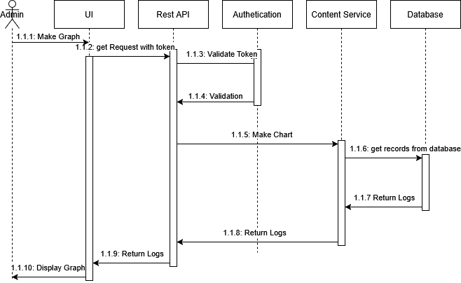

# ADD Iteration 2

## Step 1 - Review Inputs

The design inputs were established in a previous phase of the project in the following files:

```
Business Driver
Concerns.md
Constraints.md
Quality Attributes.md
Use Cases.md
```

However, they will be briefly reestablished in this document:

### Business Driver

The main driver for AIDAP is to provide a conversational interface for students, faculty, and administrators to interact with

institutional data such as course schedules, deadlines, announcements, and academic analytics. The
assistant integrates with external university systems (LMS, registration, calendars, and mail) and uses AI
to deliver contextual answers.

We want to create a system that is maintainable, scalable and reliable.
For students it will save time and keep them organized.
For instructors, it makes sharing updates and managing classes easy and simple.
For administrators, it will make data management consistent and clear.

### Concerns

- CRN-1 The system shall maintain data integrity and consistency across systems.
- CRN-2 The system shall support scalability to handle up to 5,000 concurrent users.
- CRN-3 The system shall ensure that only authorized lecturers can modify course data.
- CRN-4 The system shall protect user data and comply with institutional privacy policies.
- CRN-5 The system shall remain available 99.5% of the time per month.
- CRN-6 The system shall respond to queries within 2 seconds on average under normal load.

### Quality Attributes

- QA-1 Reliability
- QA-2 Usability
- QA-3 Privacy & Security
- QA-4 Interoperability
- QA-5 Scalability
- QA-6 Maintainability

### Use Cases

- UC-1 The student exports their calendar
- UC-2 The student uses the dashboard to view their grades
- UC-3 A lecturer posts an announcement for their course
- UC-4 A lecturer uploads courses content via the AIDAP
- UC-5 An administrator sends a campus-wide announcement
- UC-6 An administrator generates an analytics report

## Step 2 - Establish Iteration Goal by Selecting Drivers
After reviewing the drivers, iteration 2 will be focused on **Including the
Quality Attributes into the design**.

More specifically, the following drivers will be focused on during this iteration:
|Driver ID | Driver Name                                      |
|----------|--------------------------------------------------|
| QA-4     | Interoperability                                 |
| QA-6     | Maintaainability                                 |


## Step 3 - Choose One or More Elements of the System to Decompose

For Including the Quality Attributes into the design, this iteration will be focusing on:
- Communication protocols
- Logging

## Step 4 - Choose One or More Design Concepts that Satisfy the Inputs Considered in the Iteration

**Design Choice** - Communication Protocols
| Design Concept             | Pros                                        | Cons                                                         | Cost       |
| -------------------------- | ------------------------------------------- | ------------------------------------------------------------ | ---------- |
| **REST (JSON over HTTPS)** | Simple, widely supported,                   | bad for high-performance use cases                           | Low        |
| **gRPC**                   | High performance, strong typing             | Bad for browser clients                                      | Medium     |
| **GraphQL**                | Flexible queries, reduces over-fetching     | Caching is difficult                                         | High       |
| **WebSockets**             | Real-time bidirectional communication       | Requires connection management                               | Medium     |

After reviewing the above table, the decision is to move forward with a **REST (JSON over HTTPS)** api for the wide spread support.

## Step 5 - Instantiate Architectural Elements, Allocate Responsibilites, and Define Interfaces

To implement the **REST (JSON over HTTPS)** API, the following design decisions have been made:
| Design Decision                          | Rationale                                                     |
| ---------------------------------------- | ------------------------------------------------------------- |
|Enforce authentication on all endpoints   | Controlls access to system resources                          |
|Implement logging for all API interactions| Good for debugging, supports monitoring, and error tracing    |
|Introduce API rate-limiting               | Prevents abuse and ensures scalability during high-load       |

## Step 6 - Sketch Views and Record Design Decisions

##### Sequence Diagram for UC-6 (Generating Analitics Report)



##### Deployment Diagram


## Step 7 - Perform Analysis of Current Design and Review Iteration Goal and Design Objectives

| Driver ID | Design Decision                                         | Rationale                                                              |
| --------- | ------------------------------------------------------- | ---------------------------------------------------------------------- |
| QA-6      | Implement logging for all API interactions              | Structured logs simplify debugging, improving long-term maintainability|                
| QA-4      | Use REST (JSON over HTTPS) as the communication protocol| REST with JSON is widely supported, providing easy integration         |

