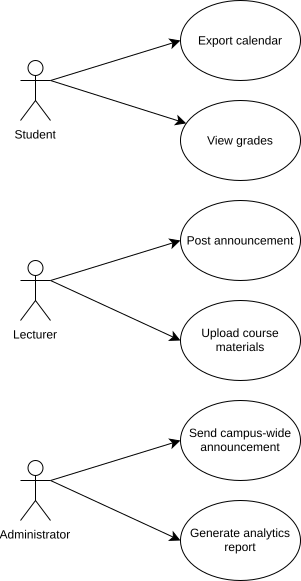

# Use Cases
After reviewing the requirements, the following 6 use cases were identified.

> [!NOTE]
> This is not an exhaustive list. These are simply 6 use cases identified of the many that exist.

- [UC-1] The student exports their calendar
  - [RS13]
- [UC-2] The student uses the dashboard to view their grades
  - [RS3]
- [UC-3] A lecturer posts an announcement for their course
  - [RL2]
- [UC-4] A lecturer uploads courses content via the AIDAP
  - [RL1]
- [UC-5] An administrator sends a campus-wide announcement
  - [RA3]
- [UC-6] An administrator generates an analytics report
  - [RA4]

## Diagram

